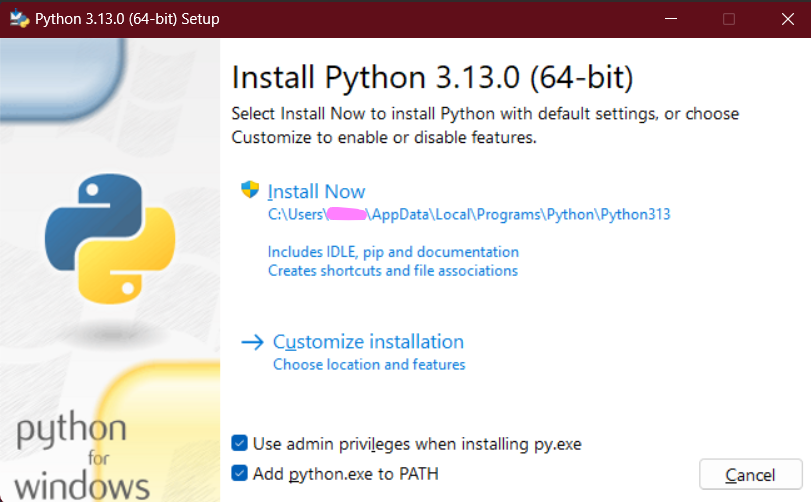
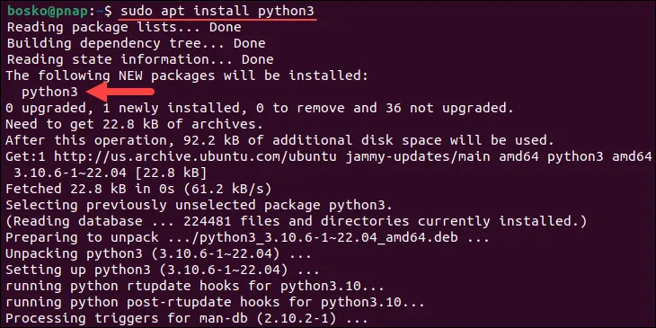
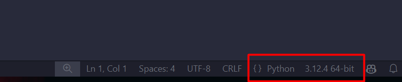

# Lesson 1: __**Introduction**__

## 1. What is Python and Why Should You Learn It?

**Python** is a high-level interpreted, versatile programming language known for its simplicity and reliability. It's widely used in web development, data analysis, automation, artificial intelligence, and more.

### **Why Should You Learn Python:**

1. **Easy to Learn and Read:** Python's syntax is clear and intuitive, making it an excellent choice for beginners.
2. **Rich Library Ecosystem:** Python boasts a vast collection of libraries (e.g., NumPy, Django) that simplify complex tasks.
3. **Versatility:** Suitable for various types of projects, from web applications to scientific computing.
4. **Large Community Support:** A robust and active community ensures plenty of resources and assistance.
5. **Cross-Platform Compatibility:** Python runs seamlessly on different operating systems, including Windows, Linux, and macOS.

## 2. How to Install Python on Windows

1. Go to [python.org](https://www.python.org/downloads/) and download the installer for your preferred Python version (the latest version is recommended).
2. Open the installer and check both boxes at the bottom of the screen .
3. Before clicking "Install Now," if you want to add extra features, click on "Customize Installation."
4. Click on "Install Now" and wait for the installation to complete.
5. **Verify the Installation:**
    - Press `WIN + R`, type `cmd`, and press Enter.
    - In the command prompt, type:
        ```bash
        python --version
        ```
        You should see the installed Python version displayed.

## 3. How to Install Python on Linux

### Using the Terminal
    # Ubuntu
    1. Open the terminal.
    2. Update the package list:
        ```bash
        sudo apt update
        ```
    3. Install Python (most Linux distributions have Python pre-installed, but this ensures you get the latest version):
        ```bash
        sudo apt install python3
        ```
    4. **Verify the Installation:**
        ```bash
        python3 --version
        ```
        

    # Arch
    1. Open the terminal
    2. Update the packages
    ```bash
        sudo pacman -Syu
    ```
    3. Install Python (most Linux distributions have Python pre-installed, but this ensures you get the latest version):
        ```bash
        sudo pacman install python3
        ```
    4. **Verify the Installation:**
        ```bash
        python3 --version
        ```
    
## 4. Install an IDE (VS Code) on Windows

For this step, we will only cover Windows installation, as Linux has different methods based on the distribution.

1. Go to [code.visualstudio.com](https://code.visualstudio.com/download).
2. Download the Windows executable.
3. Open the installer and follow the installation wizard's instructions.

## 5. Python Environments

### What Are Python Environments?

**Python environments** are isolated setups that allow you to manage dependencies for different projects without conflicts. They help maintain different versions of libraries for separate projects, avoiding issues where libraries have version conflicts. Think of them as containers where you install project-specific packages.

### Setting Up a Virtual Environment on Windows

1. Open a terminal (e.g., PowerShell or CMD).
2. Navigate to your project folder and create a virtual environment:
    ```bash
    python -m venv venv
    ```
3. Activate the virtual environment:
    ```bash
    .\venv\Scripts\activate.bat
    ```
4. To deactivate the virtual environment, simply type:
    ```bash
    deactivate
    ```

### Setting Up a Virtual Environment on Linux

1. Open the terminal.
2. Install `virtualenv` if it's not already installed:
    ```bash
    sudo apt install python3-venv
    ```
3. Navigate to your project folder and create a virtual environment:
    ```bash
    python3 -m venv venv
    ```
4. Activate the virtual environment:
    ```bash
    source venv/bin/activate
    ```
5. To deactivate the virtual environment, simply type:
    ```bash
    deactivate
    ```

## 6. Setting Up the IDE and Running Your First Project

1. **Create a Project Folder:**
    - Create a folder for your project.
    - Right-click on it and select "Open with VS Code."
2. **Create a Python File:**
    - In VS Code, go to the Explorer (press `CTRL + Shift + E`), right-click, and create a new file named `main.py`.
3. **Select Python Interpreter:**
    - In the bottom right corner, you will see something like `{} Python 3.x.x` .
    - Click on it and, at the top of your screen, you will see a selection menu.
    - Click on "Enter interpreter path," navigate to your `venv` folder, select `venv\Scripts\python.exe`, and choose it.
4. **Write Sample Code:**
    ```python
    print("Hello World!")
    ```
5. **Run Your Code:**
    - On the top navigation bar, click on "Run" and then "Run Without Debugging" (or press `CTRL + F5`).

# Exercise

Create your own project by following these steps:

1. Create a folder for your project.
2. Open that folder in your command prompt (CMD).
3. Follow the instructions to create a virtual environment.
4. Set up the VS Code IDE.
5. Write and run your code.

---
